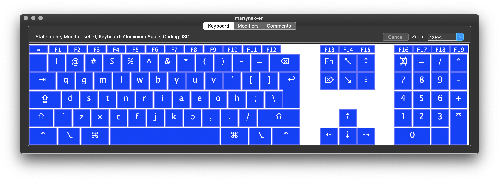
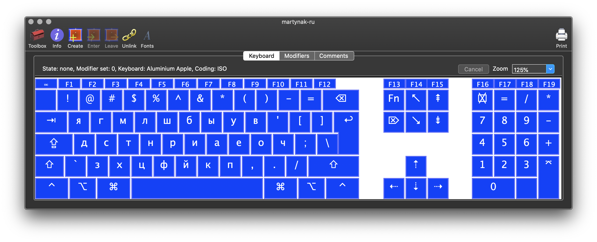
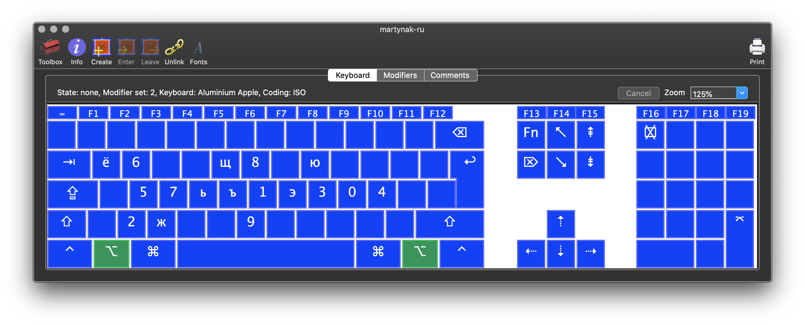

# Martynak

Martynak — optimized keyboard layout for Ru/En langs. Based on fully optimized QGMLWY layout (About: http://mkweb.bcgsc.ca/carpalx/?full_optimization).

## Table of Contents

- [Martynak](#martynak)
  - [Table of Contents](#table-of-contents)
  - [Why](#why)
  - [Examples](#examples)
  - [Usage](#usage)

## Why

### Talk about layout (Ru)

On Youtube: 

### Features

- Phonetically associated layouts
- Optimized for blind typing (and truly blind too)
- Compatibility of punctuation keys in RU/EN layouts
- QWERTY hotkey compatibility in Apps
- Low efforts and errors level

## Examples

### En layout

### Ru layout

### Both layouts on pressed alt/option

### Both layouts on pressed Cmd or Ctrl 

## Usage

### For Mac

Just run dmg file. Make layouts basic for input in both languages in the settings.

### For Windows

Download and unpack archives with Russian and English languages, then run .еxe files. Make layouts basic for input in both languages in the settings.

