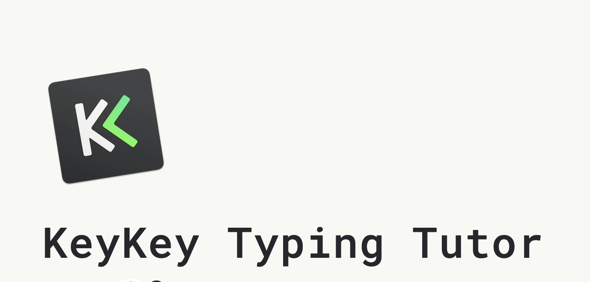

# Martynak

**Martynak** is an optimized keyboard layout for Russian and English languages, based on the [fully optimized QGMLWY layout](http://mkweb.bcgsc.ca/carpalx/?full_optimization).

## Table of Contents

- [How to](#how-to)
- [Why](#why)
  - [Talk about layout (Ru)](#talk-about-layout-ru)
  - [Features](#features)
- [Examples](#examples)
  - [English Layout](#english-layout)
  - [Russian Layout](#russian-layout)
  - [Layouts with Alt/Option Key](#layouts-with-altoption-key)
  - [Layouts with Cmd or Ctrl Key](#layouts-with-cmd-or-ctrl-key)
- [Usage](#usage)
  - [For Mac](#for-mac)
  - [For Windows](#for-windows)

## How to

Learn the English version of this layout on Mac with **KeyKey**. The Russian layout has high mnemonic compatibility, so don't worry about it. This app is available on [Setapp](https://setapp.com/ru/apps/keykey-typing-tutor) and the [App Store](https://apps.apple.com/ru/app/keykey-%D0%BA%D0%BB%D0%B0%D0%B2%D0%B8%D0%B0%D1%82%D1%83%D1%80%D0%BD%D1%8B%D0%B9-%D1%82%D1%80%D0%B5%D0%BD%D0%B0%D0%B6%D1%91%D1%80/id1035137927?mt=12).

You can also use the [Type Fu](https://type-fu.com/) extension for Chrome (Vivaldi, Opera, Edge, etc.) with custom layouts to learn both English and Russian versions. Custom layouts for this app are located at `./type-fu-layouts/`.

## Why

### Talk about layout (Ru)

**YouTube**: 

### Features

- Phonetically associated layouts
- Optimized for blind typing (and truly blind too)
- Compatibility of punctuation keys in RU/EN layouts
- QWERTY hotkey compatibility in apps
- Low effort and error levels

## Examples

### English Layout

### Russian Layout

### Layouts with Alt/Option Key

### Layouts with Cmd or Ctrl Key

## Usage

### For Mac

Run the dmg file and set the layouts as the default for input in both languages in the settings.

### For Windows

Download and unpack the archives for Russian and English languages, then run the .exe files. Set the layouts as the default for input in both languages in the settings.
